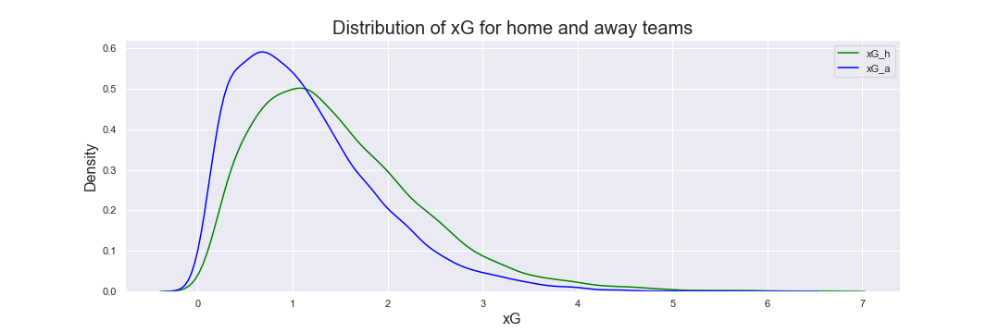

# Football-Analysis/Predictor
 
Repo for football match outcome predictor using neural networks

## Disclaimer

This analysis was conducted just of personal interest and for personal needs. It is just a personal experience. It does not imply any advice or pretend to be truthful. The code presented here can be definitely improved in quality. The resultsts are subjective and may deviate from reality.

However I would welcome any friendly discussions, questions, suggestions and comments. Please also be free to use this analysis in parts or in full for any purposes, yet reference would be appreciated. :)

## Foreword

Big credit goes to the amazing website with metrics [Understat](https://understat.com/]) and authors of [understat](https://github.com/amosbastian/understat) python library that was amzingly helpful for data collection.

## Goal

The main goal is to predict outcomes of football matches in top leagues by using comprehensive football metrics like xG.

## Structure

The project consists of 4 main files:
* `load_data.py` - for downloading and initial data wrangling
* `exploration.ipynb` - notebook for data exploration & visualizations
* `data_preprocessing.py` - for pre-processing before training
* `nn.py` - creating NN model and validating the results

and two supplements: `data_gathering_functions.py` and `data_wrangling_functions.py`.

## Detailed Description

Here is step by step description of the steps taken.

### Step 1: Data Gathering & Wrangling

The data is gathered from [Understat](https://understat.com/]) - a great sourse for in-depth football statistics (like xG and more). The data is scraped from Understat using python library [understat](https://github.com/amosbastian/understat) - an asynchronous Python package that helps to collect all the data available there.

#### Data collected

Data for six European football leagues is present on Understat:
* English Premier League 
* Spanish La Liga
* German Bundesliga
* Italian Serie A
* French Ligue 1
* Russian Premier League (RFPL)

The historical data is available starting from season 2014/15 up to last in-progress saeson 2020/21, totalling 7 seasons (6 full and 1 ongoing).

#### Collectable tables

Data on Understand is presented in various sections, hence it is required to use multiple functions to gather all the relevant data. Main information on season-level data is presented in three tables:
* Fixtures - data about key stats from each fixture in a given season in a given league. 
* Teams - some more detailed stats on each team's match.
* Players - season-level statistics of eaxh individual player (currently not used).

In addition, a match-level data for each single fixture in a season is gathered, that contains even more detailed stats and metrics. 

Foe each year/league the data is collected with a siple async loop and stored to json file:

```
async def collect_fixtures(year, league):
    async with aiohttp.ClientSession() as session:
        understat = Understat(session)
        fixtures = await understat.get_league_results(
            league, year)
        with open(p+'/data/fixtures.json', 'w') as fp:
            json.dump(fixtures, fp)
```
#### Initial processing

As the original data is not structured in a way to be used later, it gets immediatly pre-processed (partially) during the gathering stage: some features are split or renamed to better represent the data, some (e.g. duplicating) are deleted from the data. Final features from the each dataset that are left, are presented below:

**Fixtures table**

After short processing, fixtures table consists of following columns:
| Column       | Type  | Description                                       |
|--------------|-------|---------------------------------------------------|
| datetime     | str   | timestamp of the start of the fixture             |
| goals_a      | int   | goals scored by away team                         |
| goals_h      | int   | goals scored by home team                         |
| h_forecast_d | float | probability of home team to draw (bookmaker odds) |
| h_forecast_l | float | probability of home team to lose (bookmaker odds) |
| h_forecast_w | float | probability of home team to win (bookmaker odds)  |
| id           | str   | id of a fixture                                   |
| id_a         | str   | id of the away team                               |
| id_h         | str   | id of the home team                               |
| isResult     | bool  | is the fixture finished?                          |
| team_a       | str   | away team name                                    |
| team_h       | str   | home team name                                    |
| xG_a         | float | expected goals (xG) made by away team             |
| xG_h         | float | expected goals (xG) made by home team             |

**Team table**

Team table consitsts of the data for each team's matches (team's stats and opponent's stats). This data is heavily transformed so that it would fit the home/away classification of the fixtures table and added to fixtures table (e.g. classify team as home/away and their opponent to the opposite side). The columns from team-level data that are used:

| Column      | Type  | Description                                                |
|-------------|-------|------------------------------------------------------------|
| deep_a      | int   | deep passes made by away team                              |
| deep_h      | int   | deep passes made by home team                              |
| npxG_a      | float | xG without penalties for away team                         |
| npxG_h      | float | xG without penalties for home team                         |
| ppda__att_a | dict  | passes per defensive action for away team (attacking side) |
| ppda_att_h  | dict  | passes per defensive action for home team (attacking side) |
| ppda_def_a  | dict  | passes per defensive action for away team (defensive side) |
| ppda_def_h  | dict  | passes per defensive action for home team (defensive side) |
| pts_a       | int   | points away team got from the match (0, 1 or 3)            |
| pts_h       | int   | points home team got from the match (0, 1 or 3)            |
| xpts_a      | float | expected points for the match for the away team            |
| xpts_h      | float | expected points for the match for the home team            |

**Match table**

Some stats are stored in the match-level tables for each match. Therefore, each fixture id is taken to make a query to the match table and collect & transform additional stats, that are appended to the existing dataset:

| Column        | Type    | Description                             |
|---------------|---------|-----------------------------------------|
| key_passes_a  | float64 | key passes made by away team            |
| key_passes_h  | float64 | key passes made by home team            |
| red_card_a    | float64 | red cards received by away team         |
| red_card_h    | float64 | red cards received by home team         |
| shots_a       | float64 | shots made by away team                 |
| shots_h       | float64 | shots made by home team                 |
| xA_a          | float64 | expected assists (xA) made by away team |
| xA_h          | float64 | expected assists (xA) made by home team |
| xGBuildup_a   | float64 |[about xG BuildUp & Chain](https://statsbomb.com/2018/08/introducing-xgchain-and-xgbuildup/)                                         |
| xGBuildup_h   | float64 |                                         |
| xGChain_a     | float64 |                                         |
| xGChain_h     | float64 |                                         |
| yellow_card_a | float64 | yellow cards received by away team      |
| yellow_card_h | float64 | yellow cards received by home team      |

#### Calculating ELO ratings

One of the major features to be used later is the [ELO rating](https://www.eloratings.net/about) of the team. The main idea & formula are taken from the article and ratings are calculated for each team using custom-made function. THe default value for the first year for each team was 1500 & default K=40. That adds two more columns to the dataset:

| Column        | Type    | Description                             |
|---------------|---------|-----------------------------------------|
| elo_a  | float64 | elo rating before the match of the away team            |
| elo_h  | float64 | elo rating before the match of the home team            |

### Step 2: Data Exploration

Data Exploration step is present in the notebook file "exploration.ipynb".
```
# Get shape of dataset
data.shape
(13853, 44)

# Describing the dataset
data.describe()
```

| goals_h |      goals_a |         xG_h |         xG_a | h_forecast_w | h_forecast_d | h_forecast_l |      shots_h |      shots_a | yellow_card_h |   red_card_h | ... |       xpts_a |       xpxG_h |   ppda_att_h |   ppda_def_h |       deep_h |       xpts_h |        pts_h |        elo_h | elo_a        |
|--------:|-------------:|-------------:|-------------:|-------------:|-------------:|-------------:|-------------:|-------------:|--------------:|-------------:|----:|-------------:|-------------:|-------------:|-------------:|-------------:|-------------:|-------------:|-------------:|--------------|
|   count | 13853.000000 | 13853.000000 | 13853.000000 | 13853.000000 | 13853.000000 | 13853.000000 | 13853.000000 | 13853.000000 |  13853.000000 | 13853.000000 | ... | 13853.000000 | 13853.000000 | 13853.000000 | 13853.000000 | 13853.000000 | 13853.000000 | 13853.000000 | 13853.000000 | 13853.000000 |
|    mean |     1.508915 |     1.178950 |     1.476906 |     1.152637 |     0.447480 |     0.241903 |     0.310615 |    13.730672 |     11.223273 |     1.897206 | ... |     1.161337 |     1.338405 |   237.321302 |    25.014798 |     6.438750 |     1.584344 |     1.585577 |  1490.796304 |  1494.658844 |
|     std |     1.306599 |     1.152825 |     0.885260 |     0.767695 |     0.283574 |     0.111346 |     0.260603 |     5.273697 |      4.669162 |     1.322074 | ... |     1.276422 |     0.815276 |    83.262398 |     7.172355 |     4.296018 |     0.813286 |     1.317813 |   131.441556 |   131.447553 |
|     min |     0.000000 |     0.000000 |     0.000000 |     0.000000 |     0.000000 |     0.000000 |     0.000000 |     0.000000 |      0.000000 |     0.000000 | ... |     0.000000 |     0.000000 |    47.000000 |     4.000000 |     0.000000 |     0.000300 |     0.000000 |  1138.167883 |  1147.444700 |
|     25% |     1.000000 |     0.000000 |     0.818975 |     0.575886 |     0.198300 |     0.166500 |     0.088900 |    10.000000 |      8.000000 |     1.000000 | ... |     0.000000 |     0.737979 |   177.000000 |    20.000000 |     3.000000 |     0.914100 |     0.000000 |  1401.379862 |  1405.299680 |
|     50% |     1.000000 |     1.000000 |     1.319560 |     1.003800 |     0.427300 |     0.251200 |     0.239600 |    13.000000 |     11.000000 |     2.000000 | ... |     1.000000 |     1.182800 |   229.000000 |    24.000000 |     6.000000 |     1.612200 |     1.000000 |  1474.781373 |  1478.263238 |
|     75% |     2.000000 |     2.000000 |     1.968160 |     1.564340 |     0.680500 |     0.311300 |     0.487400 |    17.000000 |     14.000000 |     3.000000 | ... |     3.000000 |     1.773270 |   288.000000 |    30.000000 |     9.000000 |     2.264700 |     3.000000 |  1565.940424 |  1570.687567 |
|     max |    10.000000 |     9.000000 |     6.630490 |     6.186960 |     1.000000 |     0.859000 |     0.999700 |    47.000000 |     39.000000 |     8.000000 | ... |     3.000000 |     6.610910 |   633.000000 |    65.000000 |    42.000000 |     3.000000 |     3.000000 |  1957.502660 |  1958.810098 |

```
# Check if any NAs left
data.isna().sum()
```
| id            | 0 |
|---------------|---|
| isResult      | 0 |
| datetime      | 0 |
| team_h        | 0 |
| team_a        | 0 |
| id_h          | 0 |
| id_a          | 0 |
| goals_h       | 0 |
| goals_a       | 0 |
| xG_h          | 0 |
| xG_a          | 0 |
| h_forecast_w  | 0 |
| h_forecast_d  | 0 |
| h_forecast_l  | 0 |
| shots_h       | 0 |
| shots_a       | 0 |
| yellow_card_h | 0 |
| yellow_card_a | 0 |
| red_card_h    | 0 |
| red_card_a    | 0 |
| key_passes_h  | 0 |
| key_passes_a  | 0 |
| xA_h          | 0 |
| xA_a          | 0 |
| xGChain_h     | 0 |
| xGChain_a     | 0 |
| xGBuildup_h   | 0 |
| xGBuildup_a   | 0 |
| npxG_a        | 0 |
| ppda_att_a    | 0 |
| ppda_def_a    | 0 |
| deep_a        | 0 |
| xpts_a        | 0 |
| pts_a         | 0 |
| npxG_h        | 0 |
| ppda_att_h    | 0 |
| ppda_def_h    | 0 |
| deep_h        | 0 |
| xpts_h        | 0 |
| pts_h         | 0 |
| elo_h         | 0 |
| elo_a         | 0 |
| league        | 0 |
| match_id      | 0 |
| dtype: int64  |   |

```
# Data preview
data.head()
```
| id | isResult | datetime |              team_h |               team_a |        id_h | id_a | goals_h | goals_a |     xG_h | ... |   npxG_h | ppda_att_h | ppda_def_h | deep_h | xpts_h | pts_h |  elo_h |  elo_a | league | match_id                     |
|---:|---------:|---------:|--------------------:|---------------------:|------------:|-----:|--------:|--------:|---------:|----:|---------:|-----------:|-----------:|-------:|-------:|------:|-------:|-------:|-------:|------------------------------|
|  0 |     4749 |     True | 2014-08-16 12:45:00 |    Manchester United |     Swansea |   89 |      84 |       1 | 1.166350 | ... | 1.166350 |        253 |         25 |      8 | 2.2359 |     0 | 1500.0 | 1500.0 |    epl |      MSUaaacdeeeehinnnrssttw |
|  1 |     4750 |     True | 2014-08-16 15:00:00 |            Leicester |     Everton |   75 |      72 |       2 | 1.278300 | ... | 1.278300 |        362 |         25 |      1 | 1.9461 |     1 | 1500.0 | 1500.0 |    epl |             ELceeeeinorrsttv |
|  2 |     4751 |     True | 2014-08-16 15:00:00 |  Queens Park Rangers |        Hull |  202 |      91 |       0 | 1.900670 | ... | 1.126890 |        218 |         17 |      1 | 2.0149 |     0 | 1500.0 | 1500.0 |    epl |        HPQRaaeeegkllnnrrssuu |
|  3 |     4752 |     True | 2014-08-16 15:00:00 |                Stoke | Aston Villa |   85 |      71 |       0 | 0.423368 | ... | 0.423368 |        132 |         32 |      3 | 0.8041 |     0 | 1500.0 | 1500.0 |    epl |              ASVaeikllnoostt |
|  4 |     4753 |     True | 2014-08-16 15:00:00 | West Bromwich Albion |  Sunderland |   76 |      77 |       2 | 1.683430 | ... | 0.922260 |        184 |         31 |      6 | 2.0358 |     1 | 1500.0 | 1500.0 |    epl | ABSWabcddeehiillmnnnoorrstuw |

```# Plotting total goals per match distribution```


|       |   goals_home |   goals_away | total_goals  |
|------:|-------------:|-------------:|--------------|
| count | 13853.000000 | 13853.000000 | 13853.000000 |
|  mean |     1.508915 |     1.178950 |     2.687865 |
|   std |     1.306599 |     1.152825 |     1.663557 |
|   min |     0.000000 |     0.000000 |     0.000000 |
|   25% |     1.000000 |     0.000000 |     1.000000 |
|   50% |     1.000000 |     1.000000 |     3.000000 |
|   75% |     2.000000 |     2.000000 |     4.000000 |
|   max |    10.000000 |     9.000000 |    12.000000 |

There are usually 2-3 goals on average per game. Home team scores more on average - 1.51 goals vs 1.18 by away team.

```# Listing the games with most total goals (10+)```


Only very few games were concluded with 10 or more goals, as we can see - mostly from Spanish La Liga and quite surprisingly from Russian Premier League. Real Madrid appears (solely on the winning side) in 4 of 10 games. Interesting that not only all games are of one team dominance - 2 games of 10 could be described as fairly close with the final score of 6-4.

```# Comparing distribution of xG of teams playing home and away```



Similarly to goals, it can be seen that home teams produce more xG on average than away playing teams.

```# Plotting distribution of xG by league```


Here is the comparison of total xG per game for each of the leagues. he results are fairly similar with La Liga and Bundesliga leaning towards more xG while Ligue 1 and RFPL tend to have less average xG.

```# Plotting distribution of team elo ratings by league```


Thanks to that we can see approximate distribution of "power" inside a league. For instance comparing Serie A and Ligue 1: Italian league has more smooth and equal distribution, while French league has a spike of around Elo of 1500. That would mean that teams in Serie A flow around the Elo rating more, having better or worse results (i.e. teams like Inter, Milan, Roma, Napoli, Lazio are always having different resutls each year), while the most of French teams tend to stay within the average Elo and only handful of teams are in the lead (e.g. PSG is constantly winning).

```# Plotting last (current) elo rating of a team```


This shows the last available Ero rating of the team and which of them are the most powerful right now.

```# Plotting scatter plot between Elo and xG by league, home and away```


We can see for example that RFPL is far more concentrated (especially on the away side). On the other hand, leagues like La Liga or Bundesliga show more clearly top teams with high elo that have larger xG scores. Nevertheless the Elo seem to have not a huge impact on xG meaning that both "bad" and "good" teams can produce large (or small) xG numbers per match. 

```# Plotting pairplot for selected home team stats```


Having extended multivariate analysis on some (arbitrary) key stats shows us Elo rating being uncorrelated to other features. From obvious connections - xA is highly correlated with xG and shots. Interestingly that xA and shots correlation is much stronger than xG and shots. It is logical, but shows once again how many shots could be absolutely irrelevant to xG and hence not threatening at all. Similar picutre is seen for away stats, hence we will not display it here.

```# Plotting shots made by some popular teams home and away```


Out of curiosity, we can select few popular clubs from each league and see shot distribution. First of all it shows how home games produce more shots. Secondly there is a clear outsider in terms of shots made - Atletico Madrid, but definetely not in terms of results, which says that number of shots is not the most important key to success.

```# Plotting correlation matrix for all the features in the dataset ```


Lastly let's see the full correlation matrix. Probably the most interesting point taken is the absolute low correlation for cards, both yellow and red to all other features, meaning style of play (fair or rough) does not influence much the outcomes of the game.

### Step 3: Data Cleaning & Processing

Now it is time clean and process the data necessary for the future model training. In order to be able to calculate rolling means (used for prediction) we have to group data by each team and make calulcations for each. That raises additional issue - sonce each game is a combination of two teams, calculating data fora each team will duplicate number of games.

At this stage we firstly remove several columns that might be not fully relevant to predicting match goals. The columns removed are:

* h_forecast_d
* h_forecast_l
* h_forecast_w
* isResult 

For all the features we are planning to use, we have to do some pre-processing. Namely, we do not know the exact statistics of the match before it was played. So we need to take historical averages for each team. For that we are splitting data on per-team level, sorting it historically and calculating averages from some time perion in the past. The periods that were tried are:

* Moving average through all the historical data
* Average from last 10 games
* Average from last 5 games
* Average from last 3 games

In the end, average of last 5 games was selected, as it was the most descriptive for the data. 

In this stage we also define out target variable, that we are willing to predict. This is going to be goal difference (simply goals by home team minus goals by away team). That would imply a win of home team in case of positive number, lose of home team in case of negative number and draw in case the value is equal to zero.

Hence we are splitting the data and grouping it by each team in a historical order to calculate rolling means.

As after splitting to each team-level data, each game is represented twice (one game is played beween to team, so a game between Liverool and Manchester United will be part of both Liverpool's and United's subsets), the duplciates are identified and removed. For that a unique match id (conssiting of team names) is created. This helps to ensure that we are able to identify each unique match by the combination of new match id (teams playing) and the timestamp (it is not possible for the same two teams having more than one game at the one particular point in time).

Data is then merged back together and after more manipulation fiwh column names and suffixes, represents only one unique game and stats for both teams - home and way (disregarding of who did play that game). We may name this dataset consistent and ready to be used for the future model training training.

To make the model more precise and lightweight, we'll also drop features that seem to have to little impact on total goals scored:

* yellow cards
* red cards
* ppda_att
* ppda_def
* pts
* xpts

and a bit redundant feature:

* npxG

The location variable (home/away) is also excluded, we are viewing the game as the single game, not from the team's PoV.

The data then is getting splitted to train and test set with the ratio of 90% / 10% and getting scaled to a normal distribution based on the training set.

### Step 4: Model Training

The model is built using TF 2.0 / Keras. Multiple models were examined for a long time. The final parameters selected were:

* Model = Keras Regressor
* Input layer with 20 neurons - ReLU & L2 regularization
* Three hidden layers (16, 14 & 10 neurons) - all ReLU
* Output layer - linear activation
* Optimizer - Adam (LR = 0.001)
* Loss = MSE (+ MAE for reporting)
* Batch Size = 10
* N of Epochs = 100

The model looks like this:

```
def keras_model():
    
    model = keras.Sequential()
    model.add(layers.Dense(20, input_dim=col_number, activation='relu', kernel_initializer='normal', kernel_regularizer='l2'))
    model.add(layers.Dropout(0.2))
    model.add(layers.Dense(16, activation='relu'))
    model.add(layers.Dropout(0.2))
    model.add(layers.Dense(14, activation='relu'))
    model.add(layers.Dropout(0.1))
    model.add(layers.Dense(10, activation='relu'))
    model.add(layers.Dropout(0.1))
    model.add(layers.Dense(1, activation='linear'))
    opt = keras.optimizers.Adam(learning_rate=0.001)
    
    model.compile(loss='mean_squared_error', optimizer=opt, metrics=[tf.keras.metrics.MeanAbsoluteError()])  # Compile model
    model.summary()
    
    return model
    
estimator = KerasRegressor(build_fn=keras_model, epochs=100, batch_size=10, verbose=1,
                           validation_data=(X_test, y_test)) 
```


## Validation & Results

All models created were validated with multiple techniques. The best & selected model's results are presented below:

* The regression metrics - MSE, MAE & R2 to determine the best regression model 

```
MSE: 1.25902
MAE: 0.86262
R2: 0.60355
```

* Since goals are discrete, the results were also rounded to the nearest integer and compared to actual goal difference as classification metric. This did not yield consistent results, as there are several matches of an "outlier type" (i.e. win or lose by 5 or more goals) that appear only several times and model is having a hard time capturing outliers like this. Yet the predicrion of goal difference for some regular outcomes (i.e. in range [-3;3]) is yielding good resutls.

Classfification Report:

```
              precision    recall  f1-score   support

          -5       0.00      0.00      0.00         4
          -4       0.00      0.00      0.00        15
          -3       0.00      0.00      0.00        43
          -2       0.24      0.05      0.08       106
          -1       0.36      0.39      0.37       215
           0       0.42      0.64      0.51       284
           1       0.38      0.57      0.46       240
           2       0.25      0.20      0.22       147
           3       0.10      0.01      0.03        67
           4       0.00      0.00      0.00        37
           5       0.00      0.00      0.00        10
           6       0.00      0.00      0.00         3
           8       0.00      0.00      0.00         1

    accuracy                           0.37      1172
   macro avg       0.13      0.14      0.13      1172
weighted avg       0.30      0.37      0.32      1172

Accuracy: 0.374
Balanced Accuracy: 0.143
Precision: 0.305
Recall: 0.374
F1 Score: 0.322
```

* Lastly, the outcomes were also grouped to just a 3-way outcome: win/lose/draw and again viewed as a classification problem - how many outcomes does the model predict correctly?

```
Classfification Report:

              precision    recall  f1-score   support

          -1       0.87      0.58      0.70       383
           0       0.42      0.64      0.51       284
           1       0.82      0.79      0.80       505

    accuracy                           0.69      1172
   macro avg       0.71      0.67      0.67      1172
weighted avg       0.74      0.69      0.70      1172


Confusion Matrix:

[[224 148  11]
 [ 26 183  75]
 [  7 101 397]]

Accuracy: 0.686
Balanced Accuracy: 0.672
Precision: 0.742
Recall: 0.686
F1 Score: 0.699
```
As a result we can conclude that it is quite hard to predict game outcome using deep technical football stats like xG. As we know even "football giants" sometimes fail and small teams give us surprises. Most probably this won't help predicting outcomes and win against bookmakers. Nevertheless this analysis might be used as a supplement to one's decision.

## Licensing

MIT License Copyright (c) 2021, Artjoms Formulevics
